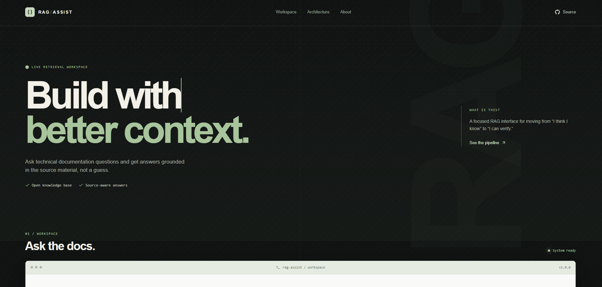
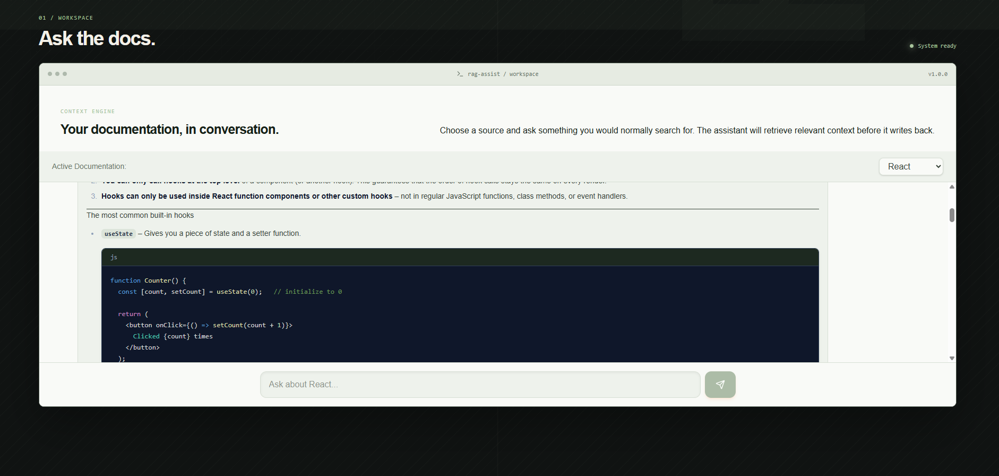
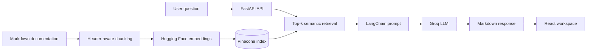

<div align="center">
  
  <h1>RAG Assist</h1>
  <p>A documentation-aware AI workspace for building with better context.</p>
  <p>
    <a href="https://rag-assist-1.onrender.com/">Live Demo</a>
    ·
    <a href="https://github.com/ysstbl/rag_assist">Source Code</a>
  </p>
</div>

RAG Assist turns technical documentation into a conversational developer tool. Ask questions about React, CSS, or JavaScript and receive answers generated from retrieved documentation rather than a generic model response.

> [!NOTE]
> The hosted frontend is available at **[rag-assist-1.onrender.com](https://rag-assist-1.onrender.com/)**. The first request may take a few seconds while the backend and model services wake up.

## Product Preview

<p align="center">
  
  
</p>

## Why It Is Interesting

- **Grounded answers:** retrieves relevant documentation context before generation.
- **Multi-source knowledge:** switch between React, CSS, and JavaScript documentation from the workspace.
- **Developer-friendly output:** renders Markdown, tables, lists, and syntax-highlighted code blocks.
- **Production-shaped architecture:** separate React frontend, FastAPI API, ingestion pipeline, and managed vector search.
- **Fast model serving:** uses Groq for low-latency response generation.

## How It Works



### Retrieval and generation flow

1. `backend/ingest.py` loads Markdown files from the bundled React and MDN content.
2. Markdown headers and recursive character splitting preserve useful document structure while creating manageable chunks.
3. Hugging Face embeddings are written to the `tech-documentation` Pinecone index with technology metadata.
4. The FastAPI backend retrieves the five most relevant chunks for each question.
5. LangChain passes the retrieved context to Groq, which produces the final answer.
6. The React client renders the response as readable Markdown with highlighted code.

## Technology Stack

| Layer | Technologies |
| --- | --- |
| Frontend | React 19, Vite, Tailwind CSS, Lucide, React Markdown |
| API | FastAPI, Uvicorn, Pydantic, Python 3.12 |
| RAG orchestration | LangChain, LangChain Core |
| Embeddings | Hugging Face `sentence-transformers/all-MiniLM-L6-v2` |
| Vector database | Pinecone |
| Generation | Groq, default model `llama-3.1-8b-instant` |

## Project Structure

```text
rag_assist/
├── backend/
│   ├── main.py                 # FastAPI app and RAG chat endpoints
│   ├── ingest.py               # Documentation chunking and Pinecone ingestion
│   ├── requirements.txt        # Python dependencies
│   ├── runtime.txt             # Python runtime version
│   ├── mdn-content/            # Local MDN CSS and JavaScript source content
│   └── react.dev/              # Local React documentation source content
├── frontend/
│   ├── src/App.jsx             # Product shell and architecture sections
│   ├── src/chat.jsx            # Interactive documentation chat
│   ├── src/index.css           # Visual system and responsive layout
│   ├── package.json            # Frontend scripts and dependencies
│   └── public/                 # Static assets
├── 1.png                       # Landing page screenshot
├── 2.png                       # Chat response screenshot
└── README.md
```

## Run Locally

### Prerequisites

- Python 3.12+
- Node.js 18+
- A Pinecone index named `tech-documentation`
- API keys for Groq, Hugging Face, and Pinecone

### 1. Configure the backend

```bash
cd backend
python -m venv .venv
source .venv/bin/activate
pip install -r requirements.txt
```

Create `backend/.env`:

```env
GROQ_API_KEY=your_groq_api_key
GROQ_MODEL=llama-3.1-8b-instant
HUGGINGFACE_API_KEY=your_huggingface_api_key
PINECONE_API_KEY=your_pinecone_api_key
```

### 2. Ingest documentation

Run this from the `backend` directory so the relative documentation paths resolve correctly:

```bash
python ingest.py
```

### 3. Start the API

```bash
uvicorn main:app --reload --port 8000
```

The API health check is available at [`http://localhost:8000/`](http://localhost:8000/).

### 4. Start the frontend

In a second terminal:

```bash
cd frontend
npm install
npm run dev
```

Open the Vite URL printed in the terminal. The current chat client is configured to call the deployed backend at `https://rag-assist-backend.onrender.com`; update the fetch URL in `frontend/src/chat.jsx` when testing against a local API.

## API Surface

| Method | Endpoint | Purpose |
| --- | --- | --- |
| `GET` | `/` | Health check |
| `POST` | `/chat` | Return a complete grounded answer |
| `POST` | `/chat/stream` | Stream generated response chunks |

Example request:

```bash
curl -X POST http://localhost:8000/chat \
  -H "Content-Type: application/json" \
  -d '{"question":"How do React hooks work?","technology":"React"}'
```

## Useful Commands

From `frontend/`:

```bash
npm run dev       # Start the development server
npm run build     # Create a production build
npm run lint      # Run ESLint
npm run preview   # Preview the production build
```

## Deployment Notes

- The frontend is a Vite application and can be deployed as a static site after `npm run build`.
- The backend is a FastAPI service served with Uvicorn.
- Configure the four backend environment variables in the hosting provider rather than committing secrets.
- Keep the Pinecone index name aligned between `backend/ingest.py` and `backend/main.py`.

## Roadmap

- Replace the hardcoded API URL with a frontend environment variable.
- Add persistent authentication and per-user query history.
- Attach source metadata and document links to every generated answer.
- Add automated retrieval-quality and API integration tests.
